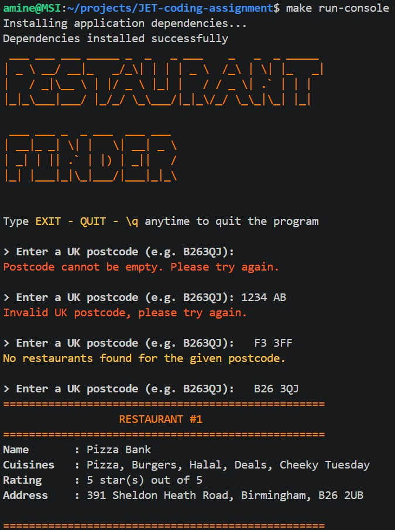
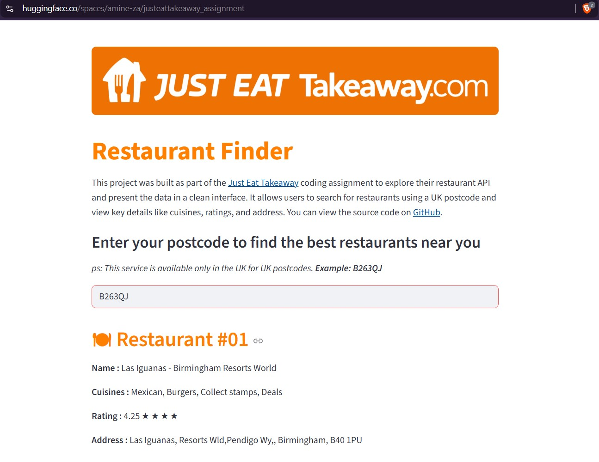
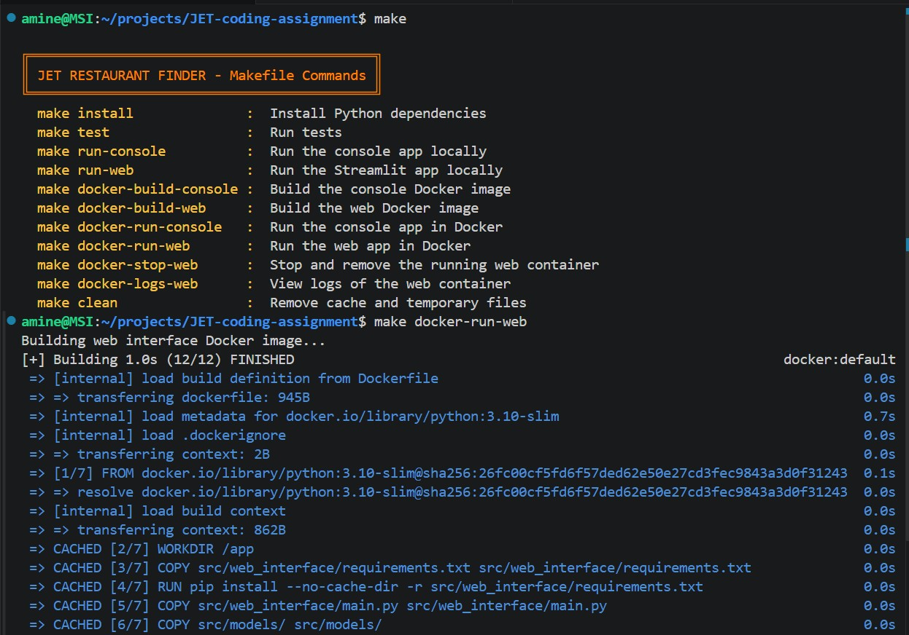
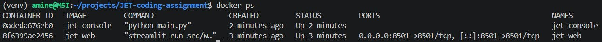

# <span style="color:#FF8000"> JET Restaurant Finder

A small app that gets restaurant data from the Just Eat API and shows the first 10 results for a UK postcode.
[Live_Demo](https://huggingface.co/spaces/amine-za/JET-restaurant-finder)

[](#)


## <span style="color:#FF8000"> Overview
JET Restaurant Finder is a Python project made for the Just Eat Takeaway coding assignment. The app takes a UK postcode, sends it to the Just Eat restaurant API, and shows the first 10 restaurants returned by the API.

The app shows the four required data points: name, cuisines, rating, and address. Using Python, I built both a web app with Streamlit and a console app. I also added Docker and a Makefile to make the project easier to run.

<p align="center">
    
    
    
    <br><br>
    
</p>


## <span style="color:#FF8000"> Live Demo

You can try the web application online without any setup:
[Live_Demo](https://huggingface.co/spaces/amine-za/JET-restaurant-finder)


## <span style="color:#FF8000"> Features

- Search restaurants by UK postcode
- Show only the first 10 restaurants
- Display:
  - Name
  - Cuisines
  - Rating
  - Address
- Web app with Streamlit
- Console app for the terminal
- Docker support
- Makefile commands for common tasks


## <span style="color:#FF8000"> Project Structure / Architecture

The project uses a `src/` layout to keep the code neat and easy to understand.

- `src/console_app/` has the console app
- `src/web_interface/` has the Streamlit web interface app
- `src/models/` has shared code and helper classes
- `Makefile` has commands for setup, testing, and running the project
- Dockerfiles are used to build clean environments for the apps

This structure keeps the app code separated from the shared logic and makes the project easier to manage.


## <span style="color:#FF8000"> Requirements

- Python 3.10+
- Docker (optional, but recommended, and the service must be running)
- Make (optional, but recommended)


## <span style="color:#FF8000"> How to Run
The project can be run in three ways: with make and Docker, with make only, or manually with Python commands. The recommended option is make with Docker, because it gives the most consistent setup across different machines. The make-only option is useful for local development, and the manual setup is available for users who prefer to install and run everything step by step.

###  <span style="color:#F6C243"> Web Interface
With make and Docker
```
make docker-run-web
```

With make and without Docker
```
make run-web
```

Without make and without Docker
+ If you do not have make and docker, you can run it directly
```bash
python3 -m venv venv
source venv/bin/activate
pip install --upgrade pip
pip install -r src/web_interface/requirements.txt
PYTHONPATH=src python3 -m streamlit run src/web_interface/main.py
```
then open http://localhost:8501


###  <span style="color:#F6C243"> Console App
With make and Docker
```
make docker-run-console
```

With make and without Docker
```
make run-console
```

Without make and without Docker
+ If you do not have make and docker, you can run it directly
```bash
python3 -m venv venv
source venv/bin/activate
pip install --upgrade pip
pip install -r src/console_app/requirements.txt
PYTHONPATH=src python3 src/console_app/main.py
```


## <span style="color:#FF8000"> Testing
I used `pytest` to test the project.<br>
The tests validate UK postcode validation logic and ensure both valid and invalid inputs are handled correctly, including edge cases and whitespace handling.  
They also verify that restaurant data is correctly parsed and formatted (name, cuisines, rating, and address) from API-like responses.

####  <span style="color:#F6C243"> Run tests with Make
```
make test
```

####  <span style="color:#F6C243"> Run tests without Make
If you do not have make, you can run pytest directly:
```
PYTHONPATH=src python3 -m pytest src/console_app/tests
```


## <span style="color:#FF8000"> Assumptions and Limitations
####  <span style="color:#F6C243"> Assumptions
- Features such as sorting or filtering are not required for this scope.
- The app currently assumes that each restaurant item contains the expected fields. I focused on the core requirements, additional checks for missing fields are a small improvement that could be added later.


####  <span style="color:#F6C243"> Limitations
+ The project was tested on my own machine and with Docker, but not on many different systems or VMs.
+ The web app depends on Streamlit (python library), so it must run in a Python environment and cannot be treated like a static website.


##  <span style="color:#FF8000"> Challenges and Trade-offs
####  <span style="color:#F6C243"> API request issue
At first, the Just Eat API returned a 403 Forbidden response. I checked with other open APIs to make sure my code was correct. After some debugging, I found that the request needed a browser-like header. I fixed it by adding a User-Agent header to the request.

####  <span style="color:#F6C243"> Import and path problems
When I moved the project to a src/ layout, I had a lot of import and path problems. I had to update the Python path and fix file paths for assets and shared modules, on top of a bunch of modifications in the dockerfiles.

####  <span style="color:#F6C243"> Fresh clone vs. easy run
I wanted the project to work right after a fresh clone, so I made the run commands depend on make install. This is a bit slower, but it avoids missing dependency problems for a new user who will call the run instruction immediately.

####  <span style="color:#F6C243"> Environment differences
I added Docker and a Makefile to reduce environment problems and make the app easier to run in a clean setup.

####  <span style="color:#F6C243"> Streamlit hosting
I built the web interface with Streamlit, a python library that lets you build web interfaces with Python, I chose it because it is simple and time-efficient. After that, I learned that it is different from a normal static website. Streamlit apps need an always running Python process, because the server must stay active while users interact with the app. Because of this, I explored different hosting options and used Hugging Face Spaces, which worked well for this type of app.

[Live_Demo](https://huggingface.co/spaces/amine-za/JET-restaurant-finder)


## <span style="color:#FF8000"> Future Improvements
+ Add sorting and filtering for the restaurant results
+ Test the project more on different machines and setups
+ Clean up some code parts and make them more readable
+ Add more tests
+ Improve error handling and edge cases
+ Improve the console app experience
+ Improve the web UI a little more


##  <span style="color:#FF8000"> AI Usage
I used AI only when I was stuck with a bug or needed help understanding an error.

I used it like a helper or mentor, not like a full solution. I still wrote the main code myself, checked the answers, and tested everything before keeping it.

AI helped me with debugging ideas, code review, and small improvements, but I made the final decisions and changes myself.
